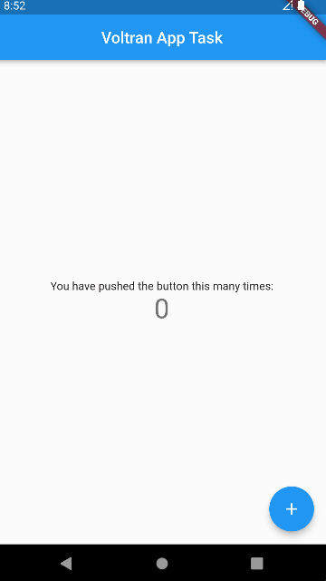

# Voltran App Task

This Flutter app allows users to record taps on a floating action button without immediately increasing the tap count. Instead, when the user long-presses the FAB, the app increments the count based on the exact timing of each tap and the delay between them. When the user long-presses the button, the count value will start to increase, and the color of the button changes from blue to red during the process.

## Preview

